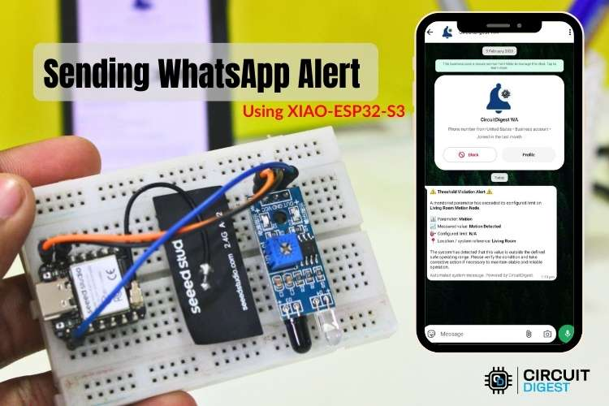
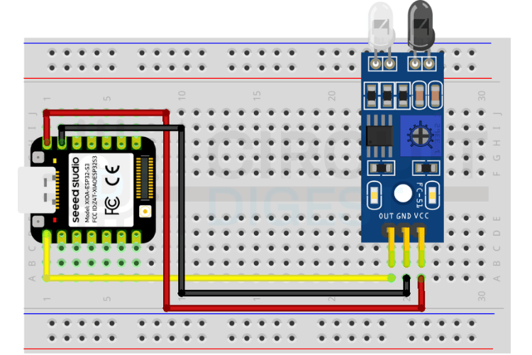
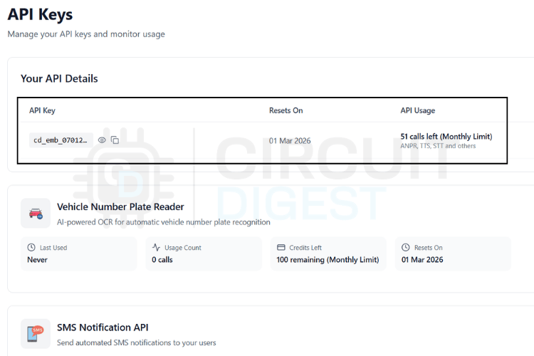

# XIAO ESP32 Based Automated WhatsApp Alert System

  

<b><i>WhatsApp Alert on Mobile</i></b>

A motion detection system that sends instant WhatsApp notifications using the XIAO-ESP32-S3 board. When the IR sensor detects movement, the device sends an alert to your phone via CircuitDigest Cloud API - no GSM module or SIM card required, just WiFi.

## Features

- Compact XIAO-ESP32-S3 board with built-in WiFi
- IR motion sensor for detection
- WhatsApp notifications via CircuitDigest Cloud
- No cellular hardware needed
- Easy cloud-based setup

## Components Required

1. XIAO-ESP32-S3 Development Board
2. IR Motion Sensor Module
3. Breadboard and Jumper Wires
4. USB Cable

## Circuit Diagram

  

### Pin Connections

| IR Sensor | XIAO-ESP32-S3 |
|-----------|---------------|
| VCC       | 3.3V          |
| GND       | GND           |
| OUT       | GPIO D2       |

## Cloud Setup

1. **Create Account**: Sign up at [CircuitDigest Cloud](https://cloud.circuitdigest.com/)
2. **Generate API Key**: Navigate to Account → API Keys and create a new key
3. **Add Phone Number**: Go to WhatsApp Notification API → Link Phone Number
4. **Verify Number**: Complete OTP verification for your WhatsApp number
5. **Note Template ID**: Use `location_movement_update` for motion alerts

  

## Installation

1. Open `Source Code/xiao-esp32-WhatsApp-Alert.ino` in Arduino IDE
2. Update the following in the code:
   - WiFi SSID and Password
   - CircuitDigest Cloud API Key
   - Your verified phone number
   - Template ID
3. Install required libraries: `WiFi`, `HTTPClient`, `ArduinoJson`
4. Upload to XIAO-ESP32-S3 board

## How It Works

The XIAO-ESP32 monitors the IR sensor continuously. When motion is detected, it sends an HTTPS POST request to CircuitDigest Cloud with your API key and message template. The cloud platform validates credentials, formats the message, and delivers it to WhatsApp instantly.

  

## Troubleshooting

- **No WiFi Connection**: Check SSID/password credentials
- **API Errors**: Verify API key and monthly quota
- **No Messages**: Ensure phone number is verified on cloud platform
- **False Triggers**: Adjust IR sensor sensitivity potentiometer

## Related Projects

- [ESP32 Projects](https://circuitdigest.com/esp32-projects)
- [Send SMS Alerts Using XIAO ESP32](https://circuitdigest.com/)
- [IR Sensor Projects](https://circuitdigest.com/)

## Contact

Visit [CircuitDigest](https://www.circuitdigest.com) for more electronics projects and tutorials.
